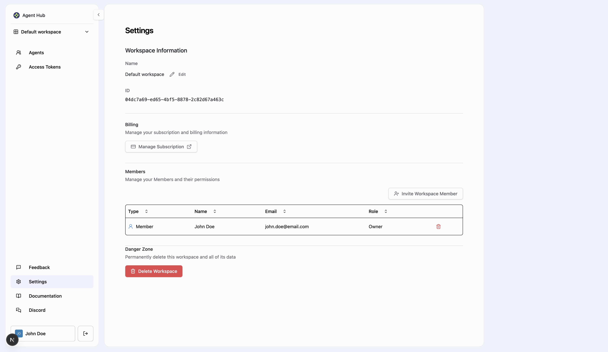
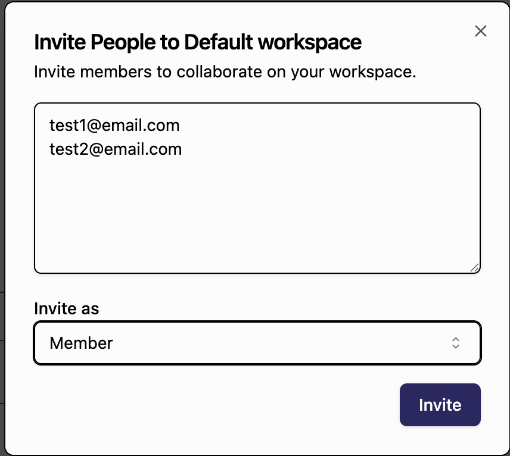
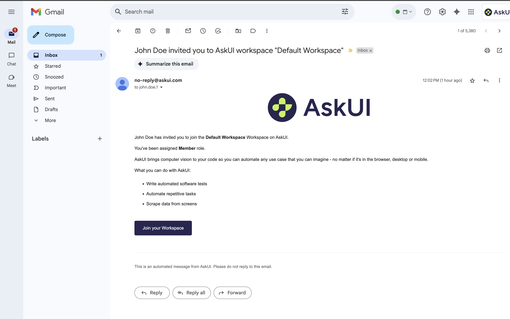
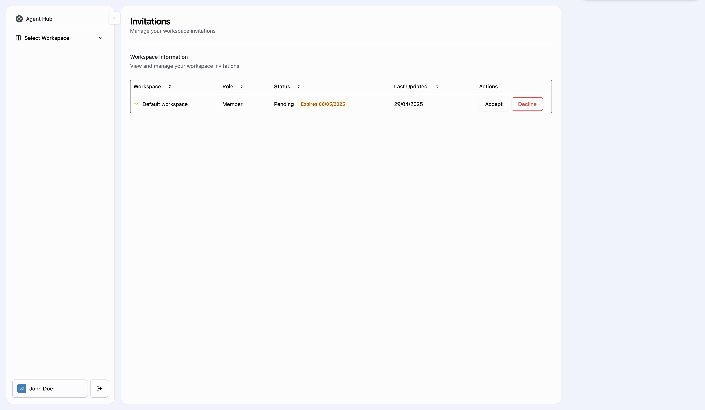
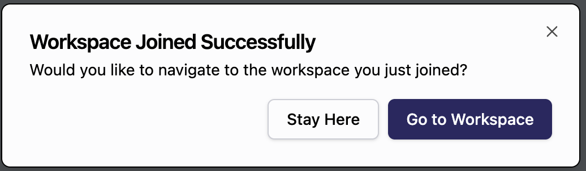

## Workspace Members Management

In AskUI, workspace members management allows you to control who has access to your workspace and what permissions they have. Members can collaborate on projects, share access to resources, and maintain organized workflows.

## Accessing Members Management

To manage your workspace members:

1. Navigate to the **Settings** tab in the left sidebar.
2. Locate the **Members** section.

Here you can view all members, their roles, and manage their permissions.

## Member Roles and Permissions

<Note>
For a deeper look at the data model and role hierarchy, see [Workspace Architecture](/03-explanation/01-foundations/workspace-architecture).
</Note>

Different roles can be assigned to workspace members when you invite them, each with specific permissions:

- **Owner**:
  - Has complete control over the workspace
  - Can add and remove other Owners
  - Can manage subscription and billing
  - Can delete the workspace
  - Has all Admin and Member permissions

- **Admin**:
  - Can add and remove non-Owner members
  - Can manage workspace resources and settings
  - Cannot manage subscription or delete workspace
  - Has all Member permissions

- **Member**:
  - Can view all workspace resources
  - Can use the platform functionality
  - Cannot add or remove other members
  - Cannot manage workspace settings

Note: Once a member's role is assigned, it cannot be changed. To change a role, you would need to remove the member and invite them again with the desired role.

## Inviting New Members

To invite new members to your workspace:

1. In the **Members** section under **Settings**, click the **Invite Workspace Member** button.
2. Enter the email address of the user you want to invite.
3. Select the appropriate role (Owner, Admin, or Member).
4. Send the invitation.

Invited users will receive an email with instructions to join your workspace.

## Accepting Workspace Invitations

When you are invited to join a workspace:

1. You will receive an email with an invitation link.
2. Click the link in the email to open the invitation in your browser.
3. You'll be directed to the **Invitations** page where you can see all your workspace invitations.
4. For pending invitations, you'll see **Accept** and **Decline** buttons in the Actions column.
5. Click **Accept** to join the workspace or **Decline** to reject the invitation.

After accepting an invitation, you'll see a confirmation popup:

The Invitations page shows:
- Workspace name
- Assigned role
- Status (Pending, Accepted, or Revoked)
- Expiration date for pending invitations
- Date the invitation was last updated
- Action buttons (Accept/Decline) for pending invitations

Note that pending invitations will expire after a certain period (shown as "Expires MM/DD/YYYY" in the Status column). The default expiration period for workspace invitations is 7 days.

## Removing Members

To remove a member from your workspace:

1. Go to the **Members** section under **Settings**.
2. Find the member you want to remove in the members list.
3. Click the trash icon button next to their name.
4. Confirm the removal when prompted.

## Workspace Information

In the **Settings** tab, you can also view and manage other workspace information, only if you have specific rights to do so:

1. Workspace Name (with an edit option)
2. Workspace ID
3. Other workspace-specific settings

**Important:** Be careful when inviting members, as their role cannot be changed after they join. If you need to modify permissions, you'll need to remove the member and re-invite them with the appropriate role. 