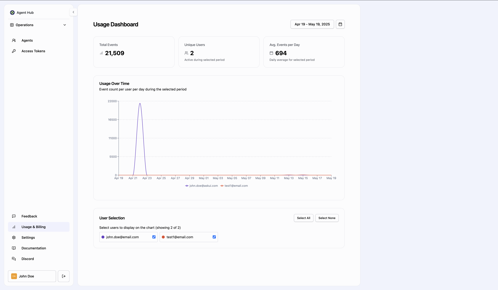

## Usage & Billing Dashboard

In AskUI, the Usage & Billing Dashboard provides comprehensive insights into your workspace usage patterns and subscription details. You can monitor execution metrics, track billing information, and analyze usage trends across your organization.

## Dashboard Overview

The Usage Dashboard provides a clear view of your execution metrics with several key components:

### Key Metrics

At the top of the dashboard, you'll find summary cards showing important metrics:

- **Total Events**: The total number of executions (e.g., 30,836)
- **Unique Users**: Number of active users who performed executions (e.g., 2)
- **Avg. Events per Day**: Average daily execution count during the selected period (e.g., 995)

You'll also see important subscription information:
- Subscription limits (e.g., 50,000 executions)
- Renewal date (e.g., May 16, 2025)

## Custom Date Selection

One of the dashboard's key features is the ability to customize your date range:

- Select specific date ranges (e.g., Apr 16 - May 16, 2025) using the date picker in the top-right corner
- Analyze trends during your chosen timeframe
- Compare usage across different periods

## Usage Over Time Chart

The dashboard includes a detailed usage graph showing:

- Event count per user per day during the selected period
- Visual trends in usage over time
- Color-coded lines representing different users (e.g., john.doe@email.com, test1@email.com)
- Y-axis showing execution volumes up to 20,000+ events
- X-axis showing dates throughout your selected period

This visualization helps identify usage patterns, peak activity periods, and individual user contributions.

## User Selection Controls

Below the graph, you'll find user selection options:

- Checkboxes to select which users to display on the chart
- Options to "Select All" or "Select None" for quick filtering
- Each user has a distinct color for easy identification on the graph

This feature allows you to focus on specific users' activities or view combined usage patterns across your team.
