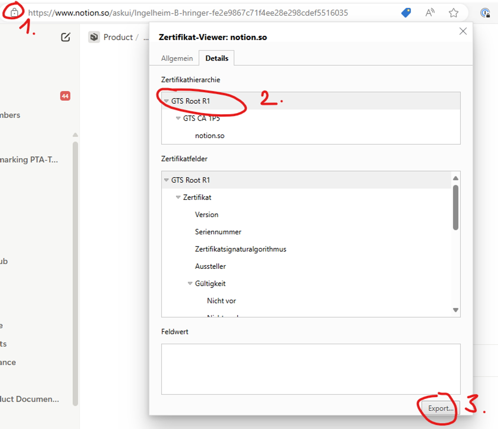
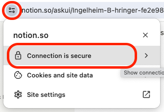
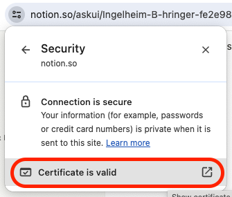
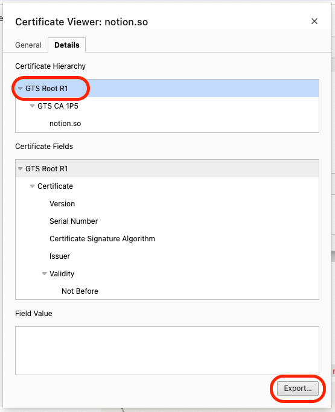

This guide helps you resolve network connectivity issues, including proxy configuration and SSL/TLS certificate problems.

## Proxy

The AskUI Shell has built-in proxy autodetection. This is the **recommended approach** for handling proxy connections:

### Recommended: Proxy Autodetection (AskUI Shell)

The AskUI Shell will automatically detect and configure the proxy settings for you.

In the background, the AskUI Shell:

1. Starts the local proxy
2. Sets HTTP_PROXY environment variables

### Alternative Options

If the automatic proxy detection doesn't work for your setup, you can use these fallback options:

#### Manual Proxy Configuration

Use the AskUI Shell command to manually set proxy settings:

```bash
AskUI-SetSettings -HttpProxy <proxy> -HttpsProxy <proxy>
```

#### Start Local Proxy Manually

For advanced users who need full control over proxy configuration, you can start the local proxy manually. See the [PxProxy documentation](https://docs.askui.com/04-reference/02-askui-suite/02-askui-suite/PxProxy/Public) for detailed instructions.

## Deep Package Inspection

Company proxies, like [Zscalar](https://www.zscaler.com/resources/security-terms-glossary/what-is-cloud-proxy), use [deep package inspection](https://en.wikipedia.org/wiki/Deep_packet_inspection) to analyze the network traffic. Such proxies are adding self-signed certificates to the HTTPS request to break up the TLS connection.

<Tabs>
  <Tab title="Python SDK">
    **Problem:** Python does not use the operating system's certificate trust store by default. When an enterprise proxy injects a custom certificate for deep packet inspection, Python cannot verify it and rejects the connection.

    **Example:**
    ```
    requests.exceptions.SSLError: [SSL: CERTIFICATE_VERIFY_FAILED] certificate verify failed (_ssl.c:852)
    ```

    **Solution:** Install the `pip-system-certs` package, which configures Python to use the system certificate store:

    ```bash
    pip install pip-system-certs
    ```
  </Tab>
  <Tab title="TypeScript SDK">
    **Problem:** Node.js does not use the operating system's certificate trust store by default. When an enterprise proxy injects a custom certificate for deep packet inspection, Node.js cannot verify it and rejects the connection.

    **Example:**
    ```
    RequestError: self signed certificate
    ```
    or
    ```
    RequestError: unable to verify the first certificate
    ```

    **Solution:** Add the proxy's self-signed certificate as extra CA Certs:

    1. Open the certificate viewer in your browser.

        Chrome: Depending on your operating system there is a **Lock**-icon left of your browser bar that opens the certificate viewer directly or another icon that opens a _Site Information_ menu where you have to select **Connection is Secure** -> **Certificate is Valid**

        Firefox: Click the **Lock**-icon left of your browser bar. click on **Connection Secure** -> **More Information**. Select the tab **Security**. Click **View Certificate**.

    2. Chrome: Open the **Details** tab.

       Firefox: Select the **GTS Root R1** certificate.
    3. Chrome: Select the Certificate **GTS Root R1** and click **Export...** on the bottom right.

       Firefox: Under **Miscellaneous**, you can download the certificate.
    4. Save it somewhere you can find it.

    
    <figcaption>*Windows Chrome: Download the certificate in the three steps marked inside the picture above.*</figcaption>

    
    <figcaption>*macOS/Unix Chrome: Open the certificate viewer step 1.*</figcaption>

    
    <figcaption>*macOS/Unix Chrome: Open the certificate viewer step 2.*</figcaption>

    
    <figcaption>*macOS/Unix Chrome: Open the certificate viewer step 3.*</figcaption>

    Use [AskUI-SetSettings -ServerIdentityCertificate reference](/04-reference/02-askui-suite/02-askui-suite/AskUI-SetSettings) to load the certificate into the necessary places of your system.

    **Additional information:**
    - [Get Zscalar custom certificate](https://help.zscaler.com/zia/adding-custom-certificate-application-specific-trusted-store)
  </Tab>
</Tabs>

## Firewall Configuration

If AskUI is blocked by your firewall, ensure the required domains are whitelisted. See the [network requirements in our Installation guide](/01-tutorials/00-installation#network-requirements) for the complete list of domains that need to be accessible.

## Next Steps

- Still having issues? [Report a bug](/02-how-to-guides/04-troubleshooting/06-reporting-bugs-and-getting-help)
- Installation problems? See [Installation and Setup](/02-how-to-guides/04-troubleshooting/01-installation-and-setup-issues)
- Runtime errors? Check [Runtime and Environment Errors](/02-how-to-guides/04-troubleshooting/05-runtime-and-environment-errors)
