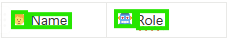
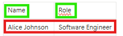
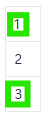
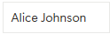

import ReTeachingOCRSentenceLevel from '/snippets/re-teaching-ocr-sentence-level.mdx';
import NewAIElement from '/snippets/new-ai-element.mdx';

This guide helps you resolve issues with element detection, OCR accuracy, and text recognition problems.

## Element Not Found

When AskUI can't find an element you're trying to interact with:

### Quick Diagnostics

1. **Capture what the agent sees:**
```python
agent.save_screenshot("debug_screenshot.png")
```

2. **Check element visibility:**
```python
# Verify element is on screen
is_visible = agent.get("Is the submit button visible?", response_schema=bool)
```

### Solutions

#### Use More Specific Descriptions
```python
# Too vague
agent.click("button")

# More specific
agent.click("blue Submit button at bottom of form")
```

#### Use Relative Positioning
```python
from askui import locators as loc

# Find element relative to others
agent.click(
    loc.Element().right_of(loc.Text("Username"))
)
```

#### Check Multi-Monitor Setup
```python
# Set active display for multi-monitor systems
agent.tools.os.set_display(1)  # Primary display
agent.click("Submit")

agent.tools.os.set_display(2)  # Secondary display
agent.click("Submit")
```

## Wrong Element Selected

When AskUI selects the wrong element from multiple similar ones:

### Solutions

#### Add Context with Relative Locators
```python
# Multiple "Edit" buttons? Be specific
agent.click(
    loc.Text("Edit").right_of(loc.Text("John Doe"))
)
```

#### Use Index for Specific Instances
```python
# Select the third button
agent.click(loc.Element("button").at_index(2))

# Or select first/last
agent.click(loc.Text("Delete").first())
agent.click(loc.Text("Delete").last())
```

#### Combine Multiple Locators
```python
# Very specific selection
agent.click(
    loc.Element("button")
        .with_text("Submit")
        .below_of(loc.Text("Terms"))
        .inside_of(loc.Element("form"))
)
```

## OCR and Text Recognition Issues

These specific OCR issues are commonly encountered in AskUI automations. Each solution is field-tested and proven effective.

### Text Detection Failures Due to Linebreaks

**Problem:** Text that appears as a single line on screen gets detected as two separate elements due to linebreaks, making exact text matching impossible.

**Common Scenario:** A button with text "Web Automation" is detected as "Web" and "Automation" separately.

**Solutions:**

<AccordionGroup>
  <Accordion title="Use containsText() for Partial Matching">
    Target the beginning of the text to avoid linebreak issues:
    
    ```typescript
    // Instead of exact match
    await aui.click().text('Web Automation').exec();
    
    // Use partial match
    await aui.click().text().containsText('Web Automation').exec();
    ```
  </Accordion>
  
  <Accordion title="Use AI Elements as Fallback">
    For consistently problematic text elements:
    
    ```typescript
    await aui.click().text('Web Automation')
                     .or()
                     .aiElement('web-automation-button')
                     .exec();
    ```
  </Accordion>
</AccordionGroup>

### Text in Overlay Merges with Text Below

**Problem:** Some overlays like dialogues don't have enough padding, so text under the overlay appears to merge with overlay text, making reliable targeting impossible.

**Example:** A dialog box with "So it starts" appears over text "1lKBASDF Aeb567878", and OCR detects them as one merged string.

**Solutions:**

<AccordionGroup>
  <Accordion title="Maximize Overlay if Possible">
    Remove underlying text by maximizing the dialog:
    
    ```typescript
    // Use keyboard shortcut to maximize dialog
    await aui.pressTwoKeys('alt', 'space').exec();
    await aui.pressKey('x').exec(); // Maximize
    ```
  </Accordion>
  
  <Accordion title="Use AI Element Fallback">
    Combine text selection with AI element as backup:
    
    ```typescript
    await aui.click().text('So it starts')
                     .or()
                     .aiElement('beginning-text')
                     .exec();
    ```
  </Accordion>
  
  <Accordion title="Target Beginning of Text">
    If exact location isn't important, target the start of the text:
    
    ```typescript
    // For merged text "1lKBASDF Aeb567878"
    // Target the first part only
    await aui.click().text().containsText('1lKBASDF').exec();
    ```
  </Accordion>
</AccordionGroup>

### Missing Blank Spaces Between Text

**Problem:** OCR sometimes fails to detect spaces between words, causing text matching failures.

**Example:** "your name" is detected as "yourname".

**Solution:**

Use regex patterns to handle missing whitespace:

```typescript
// Use regex to handle optional whitespace
await aui.click().text().withTextRegex('your[\\s]{0,1}name').exec();

// More flexible pattern for multiple words
await aui.click().text().withTextRegex('submit[\\s]{0,1}order').exec();
```

### Misspellings and Character Confusion

**Problem:** The OCR model sometimes misreads characters, especially in certain fonts or noisy images. This can result in words being misclassified or misspelled, which then causes the automation to fail when it searches for exact matches.

<Columns cols={2}>
  <Card>
    <div style={{ fontWeight: 'bold', marginBottom: '12px' }}>
      ✅ Expected Behavior
    </div>

    <div style={{ marginBottom: '8px' }}>
      ⵊ <em>Text is correctly spelled:</em>
    </div>

    <div style={{ marginBottom: '12px' }}>
      <span style={{ whiteSpace: 'nowrap' }}>
        ✅ Hallo ✅
      </span>
    </div>

    <div>
      👍 Works with `click().text("Hallo")`
    </div>
  </Card>

  <Card>
    <div style={{ fontWeight: 'bold', marginBottom: '12px' }}>
      ❌ Actual Issue
    </div>

    <div style={{ marginBottom: '8px' }}>
      ⵊ <em>Text is misspelled</em>
    </div>

    <div style={{ marginBottom: '12px' }}>
      <span style={{ whiteSpace: 'nowrap' }}>
        ❌ `HaII0` ❌
      </span>
    </div>

    <div>
      👎 Can't find `click().text("Hallo")`. Because of recognition issues. (`l`→`I` and `o` → `0`) 
    </div>
  </Card>
</Columns>

**Solutions:**

<AccordionGroup>
  <Accordion title="Re-Teach Sentence-Level OCR Model">
    You can directly correct OCR predictions and improve OCR model accuracy by training your workspace-specific model:
    
    <ReTeachingOCRSentenceLevel/>
  </Accordion>
  
  <Accordion title="Use Fuzzy Matching">
    ```python
    # Use contains() for partial matches
    agent.click(loc.Text().containing("Hel"))
    ```
  </Accordion>
  
  <Accordion title="Create AI Elements">
    For consistently problematic elements:
    
    <NewAIElement/>
  </Accordion>
</AccordionGroup>

### Text Merging Issues

**Problem:** Sometimes, Text Detector/annotation tool **merges an icon and texts into one**, even though they look separate on screen.

**Example:** Say you want to click **just the name** "Alice Johnson" field or **just the position** field in an interface - but OCR detects them as one long string:

<Columns cols={2}>
  <Card>
    <div style={{ fontWeight: 'bold', marginBottom: '12px' }}>
      ✅ Expected Behavior
    </div>

    <div style={{ marginBottom: '8px' }}>
      🖼️ <em>Icon and Text are detected separately:</em>
    </div>

    <div style={{ marginBottom: '12px' }}>
      
    </div>

    <div style={{ marginBottom: '12px' }}>
      <span style={{ whiteSpace: 'nowrap' }}>
        🧑 ✅ Name ✅  🤖 ✅ Role ✅
      </span>
    </div>

    <div>
      👍 Works with `click().text("Name")` or `click().text("Role")`
    </div>
  </Card>

  <Card>
    <div style={{ fontWeight: 'bold', marginBottom: '12px' }}>
      ❌ Actual Issue
    </div>

    <div style={{ marginBottom: '8px' }}>
      🖼️ <em>Icon and text are detected together:</em>
    </div>

    <div style={{ marginBottom: '12px' }}>
      
    </div>

    <div style={{ marginBottom: '12px' }}>
      <span style={{ whiteSpace: 'nowrap' }}>
        `🧑 Name` ❌  `🤖 Role` ✅
      </span>
    </div>

    <div>
      👎 Can't find `click().text("Name")`.
    </div>
  </Card>
</Columns>

**Solutions:**

<AccordionGroup>
  <Accordion title="Re-Teach Sentence-Level OCR Model">
    You can train the OCR Recognition model to ignore the OCR detection error:
    
    <ReTeachingOCRSentenceLevel/>
  </Accordion>
  
  <Accordion title="Use Positional Selectors">
    ```python
    # Click after the icon
    agent.click(
        loc.Element().right_of(loc.Element("icon"))
    )
    ```
  </Accordion>
  
  <Accordion title="Extract and Parse">
    ```python
    # Get merged text and parse it
    merged_text = agent.get("What is the name field content?", response_schema=str)
    # Remove icon characters or split by known patterns
    name = merged_text.replace("🧑", "").strip()
    ```
  </Accordion>
</AccordionGroup>

### Merged Texts

**Problem:** Sometimes, Text Detector/annotation tool **merges two separate texts into one**, even though they look clearly split on screen.

**Example:** Say you want to click **just the name** "Alice Johnson" field or **just the position** field in an interface - but OCR detects them as one long string:

<Columns cols={2}>
  <Card>
    <div style={{ fontWeight: 'bold', marginBottom: '12px' }}>
      ✅ Expected Behavior
    </div>

    <div style={{ marginBottom: '8px' }}>
      🖼️ <em>Text fields detected separately:</em>
    </div>

    <div style={{ marginBottom: '12px' }}>
      
    </div>

    <div style={{ marginBottom: '12px' }}>
      <span style={{ whiteSpace: 'nowrap' }}>
        `Alice Johnson` ✅  `Software Engineer` ✅
      </span>
    </div>

    <div>
      👍 Works with `text("Alice Johnson")` or `text("Software Engineer")`
    </div>
  </Card>

  <Card>
    <div style={{ fontWeight: 'bold', marginBottom: '12px' }}>
      ❌ Actual Issue
    </div>

    <div style={{ marginBottom: '8px' }}>
      🖼️ <em>Texts merged into one block:</em>
    </div>

    <div style={{ marginBottom: '12px' }}>
      
    </div>

    <div style={{ marginBottom: '12px' }}>
      <span style={{ whiteSpace: 'nowrap' }}>
        `Alice Johnson Software Engineer`❌
      </span>
    </div>

    <div>
      👎 Can't find either one on its own.
    </div>
  </Card>
</Columns>

**Solutions:**

<AccordionGroup>
  <Accordion title="Use Different Model Composition">
    Switch to word-level detection for better text separation
  </Accordion>

  <Accordion title="Use Relative Positioning">
    ```python
    # Use an anchor element to navigate
    agent.click(
        loc.Element().right_of(loc.Text().containing("Name"))
    )
    ```
  </Accordion>
</AccordionGroup>

### Text Separation

**Problem:** Sometimes, Text Detector/annotation tool separates a text into **two texts**, even though they look clearly merged on screen.

**Example:** Say you want to click "Alice Johnson" as one field - but OCR detects them as two separate words:

<Columns cols={2}>
  <Card>
    <div style={{ fontWeight: 'bold', marginBottom: '12px' }}>
      ✅ Expected Behavior
    </div>

    <div style={{ marginBottom: '8px' }}>
      🖼️ <em>Words are detected as one sentence:</em>
    </div>

    <div style={{ marginBottom: '12px' }}>
      
    </div>

    <div style={{ marginBottom: '12px' }}>
      <span style={{ whiteSpace: 'nowrap' }}>
        `Alice Johnson` ✅
      </span>
    </div>

    <div>
      👍 Works with `text("Alice Johnson")`
    </div>
  </Card>

  <Card>
    <div style={{ fontWeight: 'bold', marginBottom: '12px' }}>
      ❌ Actual Issue
    </div>

    <div style={{ marginBottom: '8px' }}>
      🖼️ <em>Words are detected as separated texts:</em>
    </div>

    <div style={{ marginBottom: '12px' }}>
      
    </div>

    <div style={{ marginBottom: '12px' }}>
      <span style={{ whiteSpace: 'nowrap' }}>
        `Alice`❌ `Johnson`❌
      </span>
    </div>

    <div>
      👎 Can't find `text("Alice Johnson")` as one.
    </div>
  </Card>
</Columns>

**Solutions:**

<AccordionGroup>
  <Accordion title="Click Individual Words">
    ```python
    # Click on either word
    agent.click(loc.Text("Alice"))
    # or
    agent.click(loc.Text("Johnson"))
    ```
  </Accordion>
  
  <Accordion title="Use Proximity Selection">
    ```python
    # Click on text near another text
    agent.click(loc.Text("Johnson").nearest_to(loc.Text("Alice")))
    ```
  </Accordion>
</AccordionGroup>

### Vertical Text Merging

**Problem:** Sometimes, Text Detector/annotation tool merges two lines to one text, even though they look clearly as two lines on screen.

<Columns cols={2}>
  <Card>
    <div style={{ fontWeight: 'bold', marginBottom: '12px' }}>
      ✅ Expected Behavior
    </div>

    <div style={{ marginBottom: '8px' }}>
      🖼️ <em>Texts are detected as two lines:</em>
    </div>

    <div style={{ marginBottom: '12px' }}>
      
    </div>

    <div style={{ marginBottom: '12px' }}>
      <span style={{ whiteSpace: 'nowrap' }}>
        `Alice Johnson` ✅
      </span>
    </div>

    <div>
      👍 Works with `text("Alice Johnson")`
    </div>
  </Card>

  <Card>
    <div style={{ fontWeight: 'bold', marginBottom: '12px' }}>
      ❌ Actual Issue
    </div>

    <div style={{ marginBottom: '8px' }}>
      🖼️ <em>Texts are detected as one text:</em>
    </div>

    <div style={{ marginBottom: '12px' }}>
      
    </div>

    <div style={{ marginBottom: '12px' }}>
      <span style={{ whiteSpace: 'nowrap' }}>
        `<no words recognized>`❌
      </span>
    </div>

    <div>
      👎 Can't find `text("Alice Johnson")` on its own.
    </div>
  </Card>
</Columns>

**Solutions:**

<AccordionGroup>
  <Accordion title="Use Different Model Composition">
    Switch to word-level detection for better line separation
  </Accordion>
  
  <Accordion title="Use AI Elements">
    Create custom AI elements for problematic multi-line text
    <NewAIElement/>
  </Accordion>
</AccordionGroup>

### Single Character Not Detected

**Problem:** Sometimes, Text Detector/annotation tool does not detect single characters, even though they are clearly visible on screen.

**Example:** Say you want to click just the character "2" - but OCR does not detect it:

<Columns cols={2}>
  <Card>
    <div style={{ fontWeight: 'bold', marginBottom: '12px' }}>
      ✅ Expected Behavior
    </div>

    <div style={{ marginBottom: '8px' }}>
      🖼️ <em>Single chars are detected:</em>
    </div>

    <div style={{ marginBottom: '12px' }}>
      
    </div>

    <div style={{ marginBottom: '12px' }}>
      <span style={{ whiteSpace: 'nowrap' }}>
        `1` ✅ `2` ✅ `3` ✅
      </span>
    </div>

    <div>
      👍 Works with `text("2")`
    </div>
  </Card>

  <Card>
    <div style={{ fontWeight: 'bold', marginBottom: '12px' }}>
      ❌ Actual Issue
    </div>

    <div style={{ marginBottom: '8px' }}>
      🖼️ <em>Char 2 is not detected:</em>
    </div>

    <div style={{ marginBottom: '12px' }}>
      
    </div>

    <div style={{ marginBottom: '12px' }}>
      <span style={{ whiteSpace: 'nowrap' }}>
        `1` ✅ `2` ❌ `3` ✅
      </span>
    </div>

    <div>
      👎 Can't find `text("2")`.
    </div>
  </Card>
</Columns>

**Solution:**

<AccordionGroup>
  <Accordion title="Use AI Element">
    Single characters are sometimes flaky. It's better to rely on AI elements:
    
    <NewAIElement/>
  </Accordion>
</AccordionGroup>

### Text Not Detected

**Problem:** Sometimes, for no apparent reason, Text Detector/annotation tool does not detect a text, even though you can see it clearly on screen.

**Example:** Say you want to click **just the name** "Alice Johnson" field - but OCR does not detect the text at all:

<Columns cols={2}>
  <Card>
    <div style={{ fontWeight: 'bold', marginBottom: '12px' }}>
      ✅ Expected Behavior
    </div>

    <div style={{ marginBottom: '8px' }}>
      🖼️ <em>Text was detected:</em>
    </div>

    <div style={{ marginBottom: '12px' }}>
      
    </div>

    <div style={{ marginBottom: '12px' }}>
      <span style={{ whiteSpace: 'nowrap' }}>
        `Alice Johnson` ✅
      </span>
    </div>

    <div>
      👍 Works with `text("Alice Johnson")`
    </div>
  </Card>

  <Card>
    <div style={{ fontWeight: 'bold', marginBottom: '12px' }}>
      ❌ Actual Issue
    </div>

    <div style={{ marginBottom: '8px' }}>
      🖼️ <em>Text wasn't detected</em>
    </div>

    <div style={{ marginBottom: '12px' }}>
      
    </div>

    <div style={{ marginBottom: '12px' }}>
      <span style={{ whiteSpace: 'nowrap' }}>
        `Alice Johnson`❌
      </span>
    </div>

    <div>
      👎 Can't find `text("Alice Johnson")`.
    </div>
  </Card>
</Columns>

**Common Causes:**
- Low contrast text
- Decorative fonts
- Text on complex backgrounds
- Very small or very large text
- Rendering issues or timing

**Solutions:**

<AccordionGroup>
  <Accordion title="Use AI Element">
    When text is not detected, the most reliable solution is to use AI Elements:
    
    <NewAIElement/>
  </Accordion>
  
  <Accordion title="Wait for Full Render">
    ```python
    agent.wait(2)  # Give UI time to fully render
    ```
  </Accordion>
  
  <Accordion title="Try Different Selection Methods">
    ```python
    # If text detection fails, try by position or appearance
    agent.click(loc.Element("text").at_coordinates(100, 200))
    ```
  </Accordion>
</AccordionGroup>

## Windows-Specific Issues

### ButtonEvent Access Denied

**Error:** `ButtonEvent down failed: Access is denied`

This occurs when:
- Windows Lock Screen is active
- RDP session is minimized

**Solutions:**

1. **For Lock Screen:** Ensure system is unlocked before running automation

2. **For RDP:** Keep session active by setting this registry key on the client machine:
```
Computer\HKEY_LOCAL_MACHINE\SOFTWARE\Microsoft\Terminal Server Client
DWORD RemoteDesktop_SuppressWhenMinimized = 2
```

## Performance Optimization

### Slow Element Detection

**Solutions:**

1. **Cache locators:**
```python
# Reuse locator objects
submit_btn = loc.Element("button").with_text("Submit")
agent.click(submit_btn)
# ... later
agent.click(submit_btn)  # Reuses cached locator
```

2. **Use specific locators:**
```python
# Slower: Natural language
agent.click("the submit button")

# Faster: Specific locator
agent.click(loc.Element("button").with_text("Submit"))
```

3. **Reduce search scope:**
```python
# Search within specific area
form_area = loc.Element("form")
agent.click(loc.Text("Submit").inside_of(form_area))
```

## Debugging Tips

### Enable Verbose Logging
```python
import logging
logging.basicConfig(level=logging.DEBUG)
```

### Visual Debugging
```python
# Save screenshots at key points
agent.save_screenshot("before_click.png")
agent.click("Submit")
agent.save_screenshot("after_click.png")
```

### Interactive Debugging
```python
# Pause to inspect state
input("Press Enter to continue after checking UI...")
```

## Common Patterns

### Retry Logic
```python
def click_with_retry(agent, locator, max_attempts=3):
    for attempt in range(max_attempts):
        try:
            agent.click(locator)
            return True
        except Exception as e:
            if attempt == max_attempts - 1:
                raise
            agent.wait(1)
```

### Wait for Element
```python
import time

def wait_for_element(agent, text, timeout=10):
    start = time.time()
    while time.time() - start < timeout:
        if agent.get(f"Is '{text}' visible?", response_schema=bool):
            return True
        agent.wait(0.5)
    return False
```

## Next Steps

- Having data extraction issues? See [Data Extraction Troubleshooting](/02-how-to-guides/04-troubleshooting/04-data-extraction)
- Network problems? Check [Network and Connectivity](/02-how-to-guides/04-troubleshooting/02-network-and-connectivity)
- Need to report an issue? Visit [Reporting Bugs](/02-how-to-guides/04-troubleshooting/06-reporting-bugs-and-getting-help)