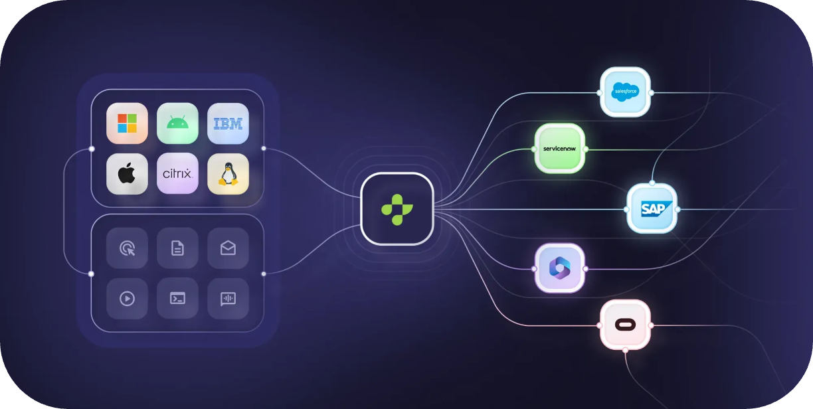

## Platform Capabilities

AskUI is an enterprise-ready platform that enables AI agents to control desktop and mobile devices through visual understanding. Unlike browser-only or chat-based solutions, AskUI provides comprehensive automation across all platforms and applications.

### Key Differentiators

- **Universal Platform Support**: Windows, macOS, Linux, Android, and iOS
- **Enterprise-Ready**: On-premise deployment, security features, and corporate proxy support
- **True Background Automation**: Agents can work without taking over your mouse and keyboard
- **Visual Intelligence**: No dependency on DOM or application internals
- **Flexible Integration**: Python and TypeScript SDKs with CI/CD support

## Features and Comparison

Key features of AskUI include:

- Support for **Windows**, **Linux**, **MacOS**, **Android** and **iOS** device automation, including Citrix environments
- Support for single-step commands as well as agentic instructions
- **In-background automation on Windows machines** (agent can create a second session; you do not have to watch it take over mouse and keyboard)
- Flexible model use (hot swap of models) and infrastructure for reteaching of models (available on-premise)
- **Secure deployment** of agents in enterprise environments

| Feature                            | AskUI Vision Agent | Computer Use by Anthropic | Operator by OpenAI | Browser Use | Custom (VLM \+ PyAutoGUI \+ Playwright) |
| ---------------------------------- | ------------------ | ------------------------- | ------------------ | ----------- | --------------------------------------- |
| Browser Use                        | ✅                  | ✅                         | ✅                  | ✅           | ✅                                       |
| DOM Support                        | ❌                  | ❌                         | ✅                  | ✅           | ✅                                       |
| Windows Use                        | ✅                  | ✅                         | ❌                  | ❌           | ✅                                       |
| Linux Use                          | ✅                  | ✅                         | ❌                  | ❌           | ✅                                       |
| MacOS Use                          | ✅                  | ✅                         | ❌                  | ❌           | ✅                                       |
| Android Use                        | ✅                  | ❌                         | ❌                  | ❌           | ❌                                       |
| iOS Use                            | ✅                  | ❌                         | ❌                  | ❌           | ❌                                       |
| In-Background Automation           | ✅                  | ❌                         | ❌                  | ❌           | ❌                                       |
| Change Detection (Automatic waits) | ✅                  | ❌                         | ❌                  | ❌           | ❌                                       |
| Multi-Screen Support               | ✅                  | ❌                         | ❌                  | ❌           | ❌                                       |
| Multi-Device Support               | ✅                  | ❌                         | ❌                  | ❌           | ❌                                       |
| Intent-based Prompting             | ✅                  | ✅                         | ✅                  | ❌           | ✅                                       |
| Single-step Commands               | ✅                  | ❌                         | ❌                  | ❌           | ❌                                       |
| Human-in-the-Loop                  | ✅                  | ✅                         | ✅                  | ❌           | ❌                                       |
| Prompting Interface                | Python, TypeScript | Chat                      | Chat               | Python      | Custom                                  |
| Enterprise Installer               | ✅                  | ❌                         | ❌                  | ❌           | ❌                                       |
| On-Premise Availability            | ✅                  | ❌                         | ❌                  | ❌           | ✅                                       |