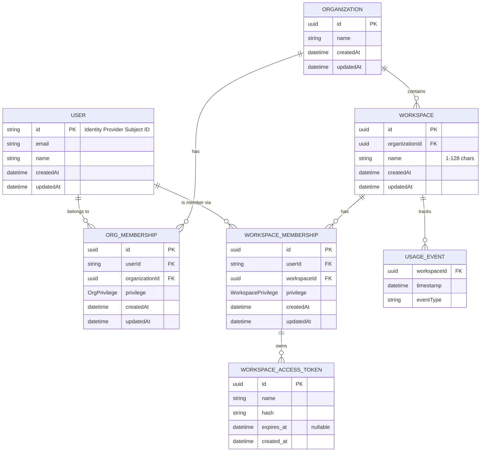
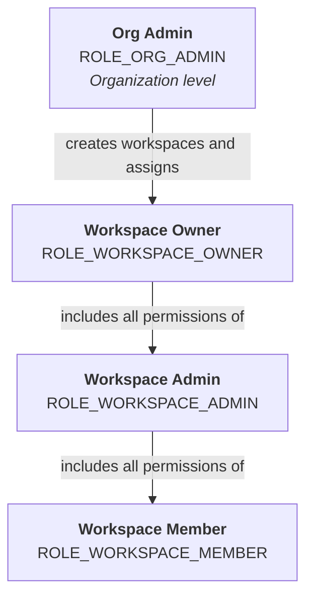
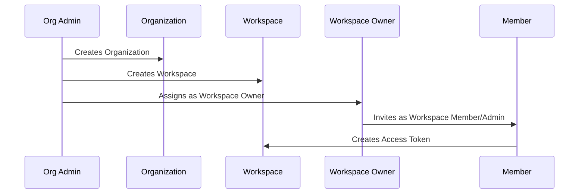

## Overview

On-premise deployments introduce an **Organization** layer above workspaces. Unlike the [SaaS model](/03-explanation/01-foundations/workspace-architecture) where any user can create workspaces self-service, on-premise deployments are centrally managed by an **Org Admin** who controls workspace provisioning and billing.

## Data Model

### Entities at a Glance

| Entity | Purpose |
| --- | --- |
| **User** | Identity record managed by the customer's identity provider. |
| **Organization** | Top-level tenant that groups workspaces, billing, and org-level users. |
| **Org Membership** | Links a User to an Organization with the `ROLE_ORG_ADMIN` privilege. |
| **Workspace** | Organisational container within an Organization for members, tokens, and usage. |
| **Workspace Membership** | Links a User to a Workspace and carries the assigned workspace-level role. |
| **Workspace Access Token** | Scoped credential tied to a specific membership (user + workspace pair). |
| **Usage Event** | Consumption record associated with a workspace for billing purposes. |

## Role Hierarchy

On-premise adds the **Org Admin** role above the workspace-level roles. The Workspace Owner role has a reduced scope compared to the SaaS model — infrastructure-level permissions move up to the Org Admin.

## Permission Matrix

### Organization Level

| Capability | Org Admin |
| --- | :---: |
| Create workspaces | ✅ |
| Delete workspaces | ✅ |
| Assign Workspace Owners | ✅ |
| Manage subscription & billing | ✅ |
| View all workspaces in the organization | ✅ |

### Workspace Level

| Capability | Workspace Owner | Workspace Admin | Workspace Member |
| --- | :---: | :---: | :---: |
| Use platform functionality | ✅ | ✅ | ✅ |
| View workspace resources | ✅ | ✅ | ✅ |
| Manage workspace resources & settings | ✅ | ✅ | ❌ |
| Invite / remove non-Owner members | ✅ | ✅ | ❌ |
| Invite / remove Owners | ✅ | ❌ | ❌ |
| Create workspaces | ❌ | ❌ | ❌ |
| Delete workspaces | ❌ | ❌ | ❌ |
| Manage subscription & billing | ❌ | ❌ | ❌ |

<Note>
A member's role **cannot be changed** after assignment. To change a role you must remove the member and re-invite them with the desired role.
</Note>

## SaaS vs On-Premise Comparison

| Capability | SaaS (Workspace Owner) | On-Prem (Org Admin) | On-Prem (Workspace Owner) |
| --- | :---: | :---: | :---: |
| Create workspaces | ✅ self-service | ✅ | ❌ |
| Delete workspaces | ✅ | ✅ | ❌ |
| Manage billing | ✅ | ✅ | ❌ |
| Assign Workspace Owners | — | ✅ | ❌ |
| Invite members to workspace | ✅ | ✅ | ✅ |
| Manage workspace resources | ✅ | ✅ | ✅ |

## How Provisioning Works

1. The **Org Admin** creates an Organization and becomes its administrator.
2. The Org Admin **creates workspaces** within the Organization.
3. The Org Admin **assigns a Workspace Owner** to each workspace, creating the first `WorkspaceMembership` with `ROLE_WORKSPACE_OWNER`.
4. The Workspace Owner **invites members** (Admin or Member roles) to collaborate.
5. Members create **Workspace Access Tokens** scoped to their membership for CI/CD and API access.

## Next Steps

- **[Workspace Architecture (SaaS)](/03-explanation/01-foundations/workspace-architecture)**: Compare with the SaaS data model and role concept
- **[Members Management](/02-how-to-guides/01-account-management/02-members-management)**: Invite members, assign roles, and manage your team
- **[Token Management](/02-how-to-guides/01-account-management/04-tokens)**: Create and manage access tokens
