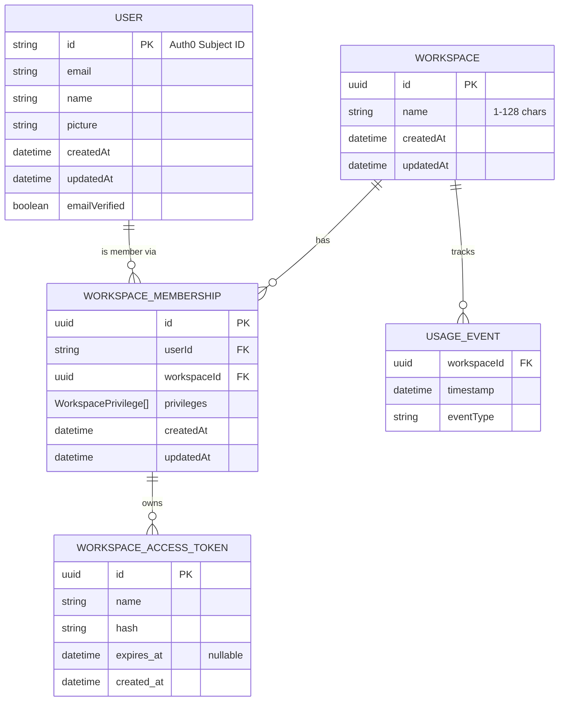

## Data Model Overview

The following Entity Relationship Diagram shows how the core entities of the AskUI workspace service relate to each other. User identity is managed externally via **Auth0**.

### Entities at a Glance

| Entity | Purpose |
| --- | --- |
| **User** | Identity record managed in Auth0 (email, name, profile picture). |
| **Workspace** | Organisational container that groups members, tokens, and usage. |
| **Workspace Membership** | Join entity that links a User to a Workspace and carries the assigned role. |
| **Workspace Access Token** | Scoped credential tied to a specific membership (user + workspace pair). |
| **Usage Event** | Consumption record associated with a workspace for billing purposes. |

## Role-Based Access Control

Every workspace membership carries exactly **one** privilege that determines what the member is allowed to do. The three roles form a strict hierarchy:

### Permission Matrix

| Capability | Owner | Admin | Member |
| --- | :---: | :---: | :---: |
| Use platform functionality | ✅ | ✅ | ✅ |
| View workspace resources | ✅ | ✅ | ✅ |
| Manage workspace resources & settings | ✅ | ✅ | ❌ |
| Add / remove non-Owner members | ✅ | ✅ | ❌ |
| Add / remove Owners | ✅ | ❌ | ❌ |
| Manage subscription & billing | ✅ | ❌ | ❌ |
| Delete workspace | ✅ | ❌ | ❌ |

<Note>
A member's role **cannot be changed** after assignment. To change a role you must remove the member and re-invite them with the desired role.
</Note>

### How Roles Are Assigned

1. The user who **creates** a workspace automatically receives the `ROLE_WORKSPACE_OWNER` privilege.
2. When an existing member **invites** a new user, they select the role at invitation time.
3. The invited user accepts the invitation and a `WorkspaceMembership` with the chosen privilege is created.

## Access Tokens

A **Workspace Access Token** is a scoped credential tied to a specific membership (user + workspace pair), typically used to authenticate API calls in CI/CD pipelines. Tokens support an optional **expiration date** and deleting a token takes effect immediately with no grace period.

<Note>
Your API credentials consist of your **Workspace ID** plus an **Access Token**. See [Token Management](/02-how-to-guides/01-account-management/04-tokens) for step-by-step instructions.
</Note>

## Next Steps

- **[Members Management](/02-how-to-guides/01-account-management/02-members-management)**: Invite members, assign roles, and manage your team
- **[Token Management](/02-how-to-guides/01-account-management/04-tokens)**: Create and manage access tokens
- **[Usage & Billing](/02-how-to-guides/01-account-management/03-usage-billing-dashboard)**: Monitor workspace consumption and billing
