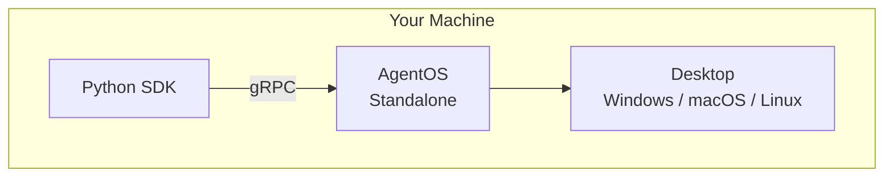
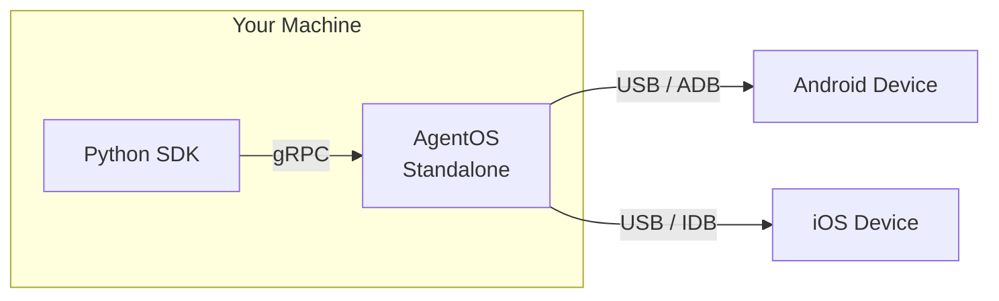
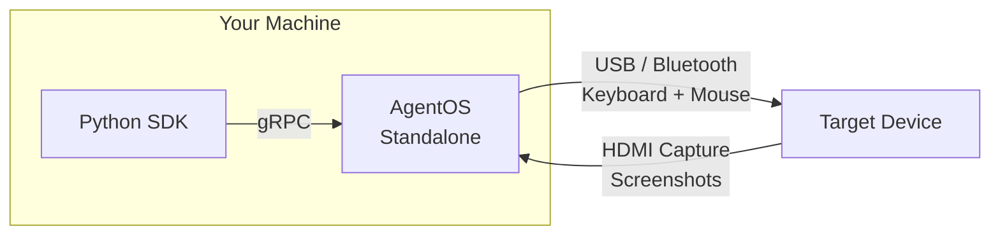

You're building and testing agents on your own machine. In all local scenarios, you install AgentOS via `pip install askui-agent-os` and your Python SDK connects to the local AgentOS instance over gRPC.

## Desktop

Automate the desktop on your own Windows, macOS, or Linux machine. AgentOS runs in standalone mode alongside your agent code.

**When to use:** Day-to-day development, debugging, and interactive testing.

**Install:** `pip install askui-agent-os` → [Standalone Installer](/06-agent-os/quickstart)

Your agent code and AgentOS run in the same machine. The SDK sends commands via gRPC, and AgentOS translates them into OS-level actions — screenshots, keyboard input, mouse control.

## Mobile Device

Automate an Android or iOS device connected to your machine via USB.

**When to use:** Mobile app testing, device interaction during development.

**Install:** `pip install askui-agent-os` → [Standalone Installer](/06-agent-os/quickstart)

AgentOS acts as a bridge: it receives commands from the SDK via gRPC and forwards them to the connected device using ADB (Android) or IDB (iOS). The device stays connected via USB.

<Note>You only need one of ADB or IDB depending on your target device — both are shown for completeness.</Note>

## KVM (External Hardware)

Control a target device through physical hardware connections — keyboard/mouse via USB or Bluetooth, screen capture via HDMI.

**When to use:** The target device can't have software installed on it (locked-down environments, embedded systems, kiosks).

**Install:** `pip install askui-agent-os` → [Standalone Installer](/06-agent-os/quickstart)

This is [Companion Mode](/06-agent-os/control-modes#companion-mode): AgentOS simulates keyboard and mouse input over USB or Bluetooth HID, and captures the target's screen via an HDMI-to-USB capture device. No software installation on the target is required.
