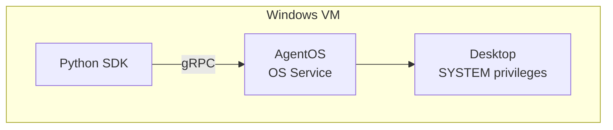
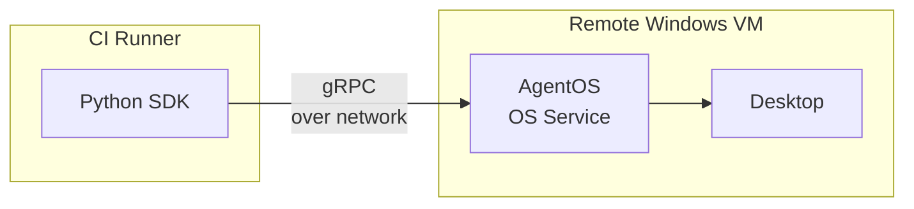
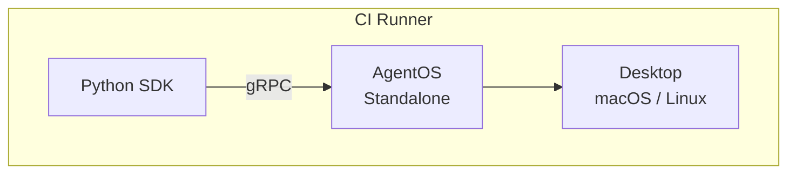
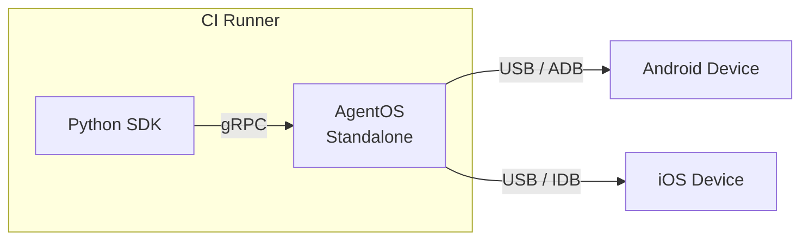

import MobileSetup from '/snippets/agent-os-mobile-setup.mdx';

You're running agents unattended in a pipeline or on remote infrastructure. The install method depends on whether you need OS service capabilities (RDP resilience, SYSTEM privileges) or standalone mode is sufficient.

## Windows VM

Run automation directly on a Windows VM that is part of your CI/CD pipeline. AgentOS runs as an OS service with SYSTEM privileges.

**When to use:** Your CI runner *is* the Windows machine you want to automate.

**Install:** [Service](/06-agent-os/installation/service) on the VM.



The Python SDK and AgentOS both run on the same VM. The OS service ensures automation continues even if no user is logged in or the RDP session disconnects.

## Remote Windows VM

Automate a Windows VM from a separate CI runner. The SDK runs on the CI runner and connects to AgentOS on the remote VM over the network.

**When to use:** Your CI runner is Linux/macOS but you need to automate a Windows desktop. Or your pipeline orchestrates work across multiple machines.

**Install:** [Service](/06-agent-os/installation/service) on the remote VM.



The SDK connects to AgentOS over the network via gRPC. The OS service on the remote VM handles desktop control independently — RDP disconnects, logon screens, and headless operation are all supported.

<AccordionGroup>
  <Accordion title="Connecting the SDK to a remote AgentOS">
    By default, the SDK starts a local AgentOS instance. To connect to a remote VM instead, disable autostart and point the SDK to the remote address.

    <Steps>
      <Step title="Disable local autostart">
        Set `ASKUI_CONTROLLER_CLIENT_SERVER_AUTOSTART` to `false` so the SDK doesn't start a local AgentOS instance.

        <Tabs>
          <Tab title="Windows PowerShell">
            ```powershell
            $env:ASKUI_CONTROLLER_CLIENT_SERVER_AUTOSTART="false"
            ```
          </Tab>
          <Tab title="macOS/Linux">
            ```bash
            export ASKUI_CONTROLLER_CLIENT_SERVER_AUTOSTART=false
            ```
          </Tab>
        </Tabs>
      </Step>
      <Step title="Set the remote address">
        Point `ASKUI_CONTROLLER_CLIENT_SERVER_ADDRESS` to the AgentOS service on the remote VM. Replace `192.168.1.100` with your VM's IP address.

        <Tabs>
          <Tab title="Windows PowerShell">
            ```powershell
            $env:ASKUI_CONTROLLER_CLIENT_SERVER_ADDRESS="192.168.1.100:26000"
            ```
          </Tab>
          <Tab title="macOS/Linux">
            ```bash
            export ASKUI_CONTROLLER_CLIENT_SERVER_ADDRESS=192.168.1.100:26000
            ```
          </Tab>
        </Tabs>
      </Step>
      <Step title="Verify the connection">
        Run your agent code. The SDK should connect to the remote AgentOS instance instead of starting a local one. Check that the remote VM's port `26000` is reachable from your CI runner.
      </Step>
    </Steps>
  </Accordion>
</AccordionGroup>

## macOS / Linux CI Runner

Run automation on a macOS or Linux CI runner. AgentOS runs in standalone mode.

**When to use:** Your CI pipeline runs on macOS or Linux and you want to automate the desktop on that same runner.

**Install:** `pip install askui-agent-os`



Same as local development — AgentOS runs in standalone mode alongside your test code. Ensure the CI runner has a display (real or virtual) available.

## Mobile Device in CI

Automate Android or iOS devices connected to your CI runner via USB.

**When to use:** Mobile testing in your pipeline — the device is physically connected to the CI runner.

**Install:** `pip install askui-agent-os` on the CI runner.



AgentOS runs on the CI runner and communicates with the connected device over USB. The CI runner needs physical USB access to the device (or a USB-over-network solution).

<MobileSetup />
