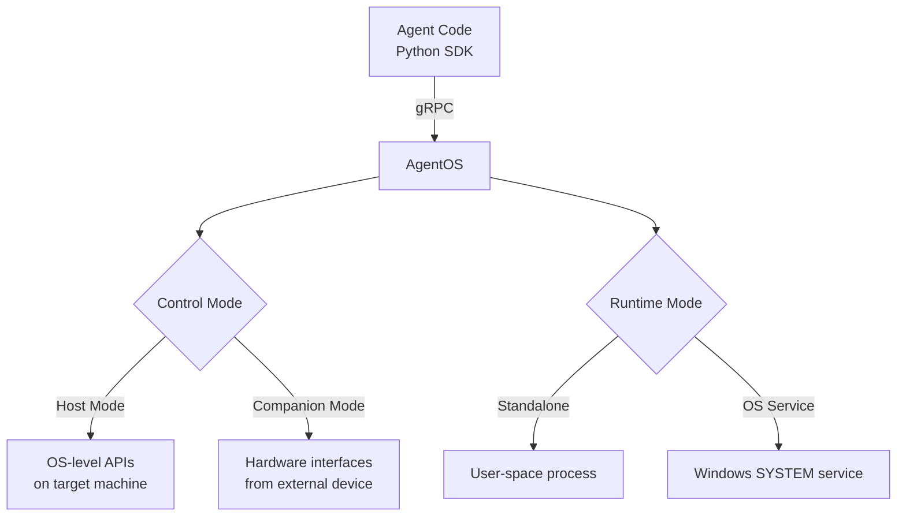

AgentOS has three core concepts that determine what it can do and how it connects to a target machine. While the concepts below involve OS-level services, kernel drivers, and hardware interfaces, **you don't need to understand these internals to use AgentOS**. The installer handles the complexity — non-technical users can set up AgentOS through a guided UI without touching configuration files or the command line.

AgentOS is **platform independent** — it supports Windows, macOS, Linux, Android, and iOS (planned), so the same agent code works across operating systems.

## Control Modes

Control modes define **how AgentOS connects to the target machine**. There are two:

- **Host Mode** — AgentOS runs directly on the target as software. It uses OS-level APIs for screenshots, input, and window management. This is the most common setup.
- **Companion Mode** — AgentOS runs on a separate device and controls the target through hardware (USB, Bluetooth, HDMI capture) or device bridges (ADB, IDB). No software installation on the target is needed.

Both modes expose the same interface to your agent code — the SDK doesn't need to know which mode is active.

[Learn more about Control Modes →](/06-agent-os/understanding/control-modes)

## Runtime Modes

Runtime modes define **how AgentOS runs on the machine it's installed on**. There are two:

- **Standalone** — AgentOS runs as a regular process in the user's session. Install via `pip install askui-agent-os`. Best for local development and testing.
- **OS Service** — AgentOS runs as a Windows system service with SYSTEM privileges. Install via the [Service](/06-agent-os/installation/service). Best for CI/CD, headless VMs, and enterprise deployments.

The runtime mode only applies to Host Mode. Companion Mode always runs standalone on the companion device.

[Learn more about Runtime Modes →](/06-agent-os/understanding/runtime-modes)

## Capabilities

Capabilities are the building blocks your agents use — screenshots, keyboard input, mouse control, window management, process management, and more.

What's available depends on the combination of control mode and runtime mode:

| | Host Mode (Standalone) | Host Mode (OS Service) | Companion Mode |
| --- | --- | --- | --- |
| Screenshots | Yes | Yes | Yes (HDMI capture) |
| Keyboard & mouse | Yes | Yes | Yes (USB/Bluetooth HID) |
| Window & process management | Yes | Yes | — |
| RDP resilience | — | Yes | — |
| Logon screen & CTRL+ALT+DEL | — | Yes | — |
| Mobile devices (ADB/IDB) | — | — | Yes |

[See all Capabilities →](/06-agent-os/understanding/capabilities)

## How They Fit Together

Think of it as two independent choices:

1. **Control mode** — *How do I reach the target?* Software on the target (Host) or hardware from outside (Companion).
2. **Runtime mode** — *How does AgentOS run?* As a regular process (Standalone) or as a system service (OS Service).

Your agent code stays the same regardless of the combination. The SDK connects to AgentOS via gRPC, and AgentOS handles the rest.

<CardGroup cols={3}>
  <Card title="Control Modes" icon="desktop" href="/06-agent-os/understanding/control-modes">
    Host Mode vs Companion Mode.
  </Card>
  <Card title="Runtime Modes" icon="toggle-on" href="/06-agent-os/understanding/runtime-modes">
    Standalone vs OS Service.
  </Card>
  <Card title="Capabilities" icon="list-check" href="/06-agent-os/understanding/capabilities">
    Full capability matrix.
  </Card>
</CardGroup>
