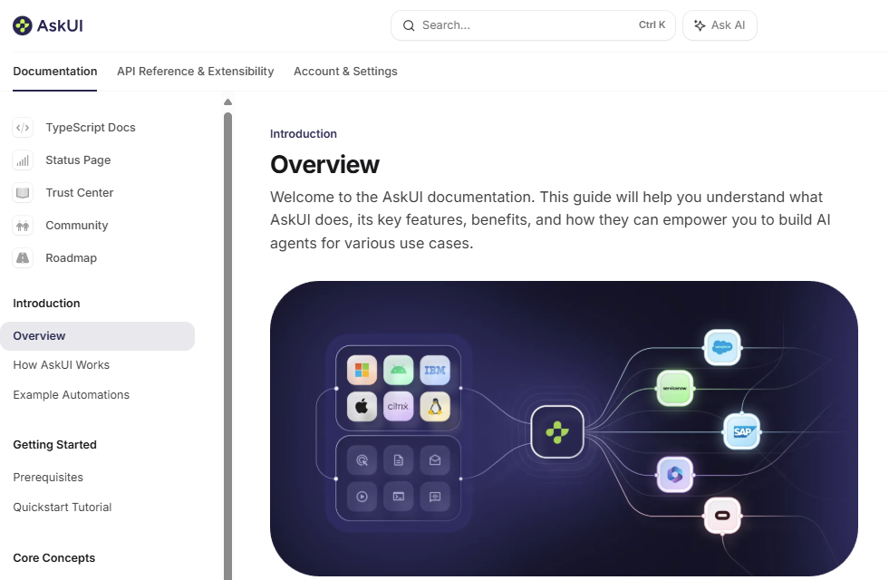

You can use the agent to extract the structure of tab bars, including which tab is currently active. This is useful for validating navigation, UI state, or automating tests involving tabbed interfaces.

To do this, define a response schema that models the tab bar:

```python
class Tab(ResponseSchemaBase):
    name: List[str]
    active: bool

class TabBar(ResponseSchemaBase):
    tabs: List[Tab]
```

Then, use the agent to extract the tabs from your application:

```python
with VisionAgent() as agent:
    result = agent.get("Can you extract me the tabs?", response_schema=TabBar)
    print(result.model_dump_json(indent=2))
```

**Example**

Suppose you have the following tab bar in your application:



The extracted output would look like:

```json
{
  "tabs": [
    {
      "name": [
        "Documentation"
      ],
      "active": true
    },
    {
      "name": [
        "API Reference & Extensibility"
      ],
      "active": false
    },
    {
      "name": [
        "Account & Settings"
      ],
      "active": false
    }
  ]
}
```

This approach allows you to retrieve the tab bar as a structured JSON object, making it easy to inspect the available tabs and determine which one is active.

> **Tip:**  
> Adjust the schema to match your tab bar’s structure, and use clear instructions to get accurate results.


