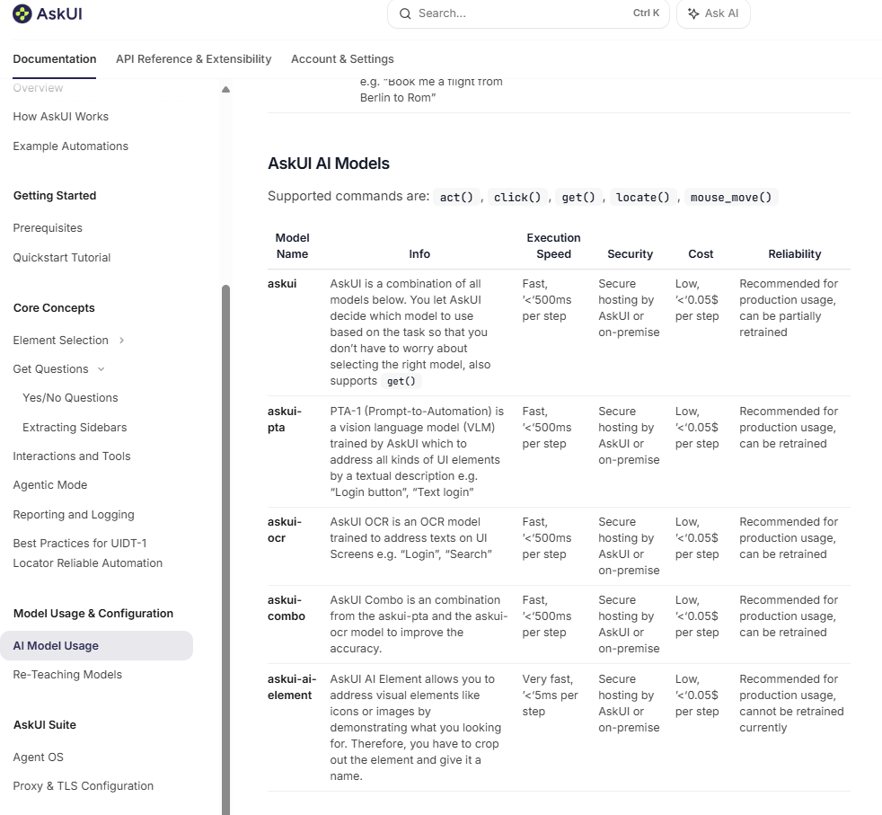

You can use the agent to extract table data from your application UI, converting rows and columns into structured objects. This is useful for validating data, automating reporting, or further processing in your workflows.

To do this, define a response schema that models the table and its entries:

```python
class Entry(ResponseSchemaBase):
    model_name: str
    infor: str
    execution_speed: str
    security: str
    costs: str
    reliability: str

class Table(ResponseSchemaBase):
    rows: List[Entry]
```

Then, use the agent to extract the table from your application:

```python
with VisionAgent() as agent:
    result = agent.get("Can you extract me the table?", response_schema=Table)
    print(result.model_dump_json(indent=2))
```

**Example**

Suppose you have the following table in your application:



The extracted output would look like:

```json
TDB
```

This approach allows you to retrieve the table as a structured JSON object, making it easy to inspect, validate, or process the data programmatically.

> **Tip:**  
> Adjust the schema to match your table’s columns, and use clear instructions to get accurate


