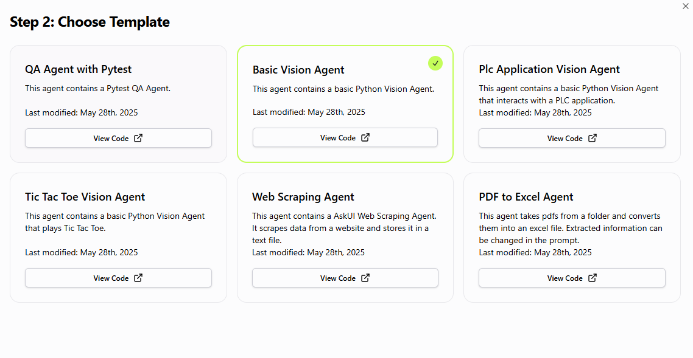

You can use the agent to extract card data from your application UI, converting each card into a structured object. This is useful for validating content, automating reporting, or further processing in your workflows.

To do this, define a response schema that models the cards and their fields:

```python
class Card(ResponseSchemaBase):
    title: str
    description: str
    date: str = Field(description="The date in ISO format, e.g., '2023-10-01T12:00:00Z'")

class Cards(ResponseSchemaBase):
    cards: List[Card]
```

Then, use the agent to extract all cards from your application:

```python
with VisionAgent() as agent:
    result = agent.get("Can you extract me all the cards of the page?", response_schema=Cards)
    print(result.model_dump_json(indent=2))
```

**Example**

Suppose you have the following cards in your application:



The extracted output would look like:

```json
{
  "cards": [
    {
      "title": "QA Agent with Pytest",
      "description": "This agent contains a Pytest QA Agent.",
      "date": "2025-05-28T00:00:00Z"
    },
    {
      "title": "Basic Vision Agent",
      "description": "This agent contains a basic Python Vision Agent.",
      "date": "2025-05-28T00:00:00Z"
    },
    {
      "title": "Tic Tac Toe Vision Agent",
      "description": "This agent contains a basic Python Vision Agent that plays Tic Tac Toe.",
      "date": "2025-05-28T00:00:00Z"
    },
    {
      "title": "Web Scraping Agent",
      "description": "This agent contains a AskUI Web Scraping Agent. It scrapes data from a website and stores it in a text file.",
      "date": "2025-05-28T00:00:00Z"
    },
    {
      "title": "Plc Application Vision Agent",
      "description": "This agent contains a basic Python Vision Agent that interacts with a PLC application.",
      "date": "2025-05-28T00:00:00Z"
    },
    {
      "title": "PDF to Excel Agent",
      "description": "This agent takes pdfs from a folder and converts them into an excel file. Extracted information can be changed in the prompt.",
      "date": "2025-05-28T00:00:00Z"
    }
  ]
}
```

This approach allows you to retrieve the cards as a structured JSON object, making it easy to inspect, validate, or process the data programmatically.

> **Tip:**  
> Adjust the schema to match your card’s fields, and use clear instructions to get accurate results.


