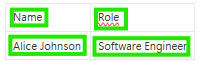
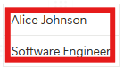

import ModelCompositionSentenceLevelOnGlobalLevel from '/snippets/model-composition-sentence-level-on-global-level.mdx';
import ModelCompositionSentenceLevelOnStepLevel from '/snippets/model-composition-sentence-level-on-step-level.mdx';
import ModelCompositionWordLevelOnGlobalLevel from '/snippets/model-composition-word-level-on-global-level.mdx';
import ModelCompositionWordLevelOnStepLevel from '/snippets/model-composition-word-level-on-step-level.mdx';
import ModelCompositionDefaultWordLevelOnStepLevel from '/snippets/model-composition-default-word-level-on-step-level.mdx';
import ReTeachingOCRSentenceLevel from '/snippets/re-teaching-ocr-sentence-level.mdx';
import NewAIElement from '/snippets/new-ai-element.mdx';

# Misspellings of Words

**Problem:** The OCR model sometimes misreads characters, especially in certain fonts or noisy images. This can result in words being misclassified or misspelled, which then causes the automation to fail when it searches for exact matches.

**Example:**
<Columns cols={2}>
  <Card>
    <div style={{ fontWeight: 'bold', marginBottom: '12px' }}>
      ✅ Expected Behavior
    </div>

    <div style={{ marginBottom: '8px' }}>
      ⵊ <em>Text is correctly spelled:</em>
    </div>

    <div style={{ marginBottom: '12px' }}>
      <span style={{ whiteSpace: 'nowrap' }}>
        ✅ Hallo ✅
      </span>
    </div>

    <div>
      👍 Works with `click().text("Hallo")`
    </div>
  </Card>

  <Card>
    <div style={{ fontWeight: 'bold', marginBottom: '12px' }}>
      ❌ Actual Issue
    </div>

    <div style={{ marginBottom: '8px' }}>
      ⵊ <em>Text is misspelled</em>
    </div>

    <div style={{ marginBottom: '12px' }}>
      <span style={{ whiteSpace: 'nowrap' }}>
        ❌ `HaII0` ❌
      </span>
    </div>

    <div>
      👎 Can't find `click().text("Hallo")`. Because of recognition issues. (`l`->`I`and `o` -> `0`) 
    </div>
  </Card>
</Columns>


### Solutions
<AccordionGroup>
  <Accordion title="Re-Teach Sentence-Level OCR Model">
    You can directly correct OCR predictions and improve OCR model accuracy by training your workspace-specific model.
    
    <ReTeachingOCRSentenceLevel/>
  </Accordion> 
</AccordionGroup> 

# Text Detection Issues

## 1. Icon Text Merging

**Problem:** Sometimes, Text Detector/annotation tool, **merges an icon and texts into one**, even though they look merged on screen.

**Example:** Say you want to click **just the name** “Alice Johnson” field or **just the position** field in a interface - but OCR detects them as one long string:

<Columns cols={2}>
  <Card>
    <div style={{ fontWeight: 'bold', marginBottom: '12px' }}>
      ✅ Expected Behavior
    </div>

    <div style={{ marginBottom: '8px' }}>
      🖼️ <em>Icon and Text are detected separately:</em>
    </div>

    <div style={{ marginBottom: '12px' }}>
      
    </div>

    <div style={{ marginBottom: '12px' }}>
      <span style={{ whiteSpace: 'nowrap' }}>
        🧑 ✅ Name ✅  🤖 ✅ Role ✅
      </span>
    </div>

    <div>
      👍 Works with `click().text("Name")` or `click().text("Name")`
    </div>
  </Card>

  <Card>
    <div style={{ fontWeight: 'bold', marginBottom: '12px' }}>
      ❌ Actual Issue
    </div>

    <div style={{ marginBottom: '8px' }}>
      🖼️ <em>Icon and text are detected together:</em>
    </div>

    <div style={{ marginBottom: '12px' }}>
      
    </div>

    <div style={{ marginBottom: '12px' }}>
      <span style={{ whiteSpace: 'nowrap' }}>
        `🧑 Name` ❌  `🤖 Role` ✅
      </span>
    </div>

    <div>
      👎 Can't find `click().text("Name")`.
    </div>
  </Card>
</Columns>

### Solution


<AccordionGroup>
 <Accordion title="Re-Teach Sentence-Level OCR Model">
    You can ignore train the OCR Recognition model to ignore the OCR detection error.
    
    <ReTeachingOCRSentenceLevel/>
  </Accordion>
  <Accordion title="Use Custom Model Word-Level Detection"> 
    <ModelCompositionWordLevelOnStepLevel/> 
  </Accordion> 
 </AccordionGroup> 

## 2. Merged Texts

**Problem:** Sometimes, Text Detector/ annotation tool, **merges two separate texts into one**, even though they look clearly split on screen.

**Example:** Say you want to click **just the name** “Alice Johnson” field or **just the position** field in a interface - but OCR detects them as one long string:

<Columns cols={2}>
  <Card>
    <div style={{ fontWeight: 'bold', marginBottom: '12px' }}>
      ✅ Expected Behavior
    </div>

    <div style={{ marginBottom: '8px' }}>
      🖼️ <em>Text fields detected separately:</em>
    </div>

    <div style={{ marginBottom: '12px' }}>
      
    </div>

    <div style={{ marginBottom: '12px' }}>
      <span style={{ whiteSpace: 'nowrap' }}>
        `Alice Johnson` ✅  `Software Engineer` ✅
      </span>
    </div>

    <div>
      👍 Works with `text("Alice Johnson")` or `text("Software Engineer")`
    </div>
  </Card>

  <Card>
    <div style={{ fontWeight: 'bold', marginBottom: '12px' }}>
      ❌ Actual Issue
    </div>

    <div style={{ marginBottom: '8px' }}>
      🖼️ <em>Texts merged into one block:</em>
    </div>

    <div style={{ marginBottom: '12px' }}>
      
    </div>

    <div style={{ marginBottom: '12px' }}>
      <span style={{ whiteSpace: 'nowrap' }}>
        `Alice Johnson Software Engineer`❌
      </span>
    </div>

    <div>
      👎 Can't find either one on its own.
    </div>
  </Card>
</Columns>


### Solutions
<AccordionGroup>
  <Accordion title="Use Default Word-Level Detection (Best Practice)">
    <ModelCompositionDefaultWordLevelOnStepLevel/>
  </Accordion>

  <Accordion title="Use Custom Model Word-Level Detection">
    <ModelCompositionWordLevelOnStepLevel/> 
  </Accordion>

  <Accordion title="Use relative anchore Element">
    This command show how you can use an anchore element move the mouse over another element. 
    ```tsx
      await aui.moveMouseRelativeTo(100, 0).containsText("Name").exec()
    ```
  </Accordion>
</AccordionGroup>


## 3.Text Separation

**Problem:** Sometimes, Text Detector/ annotation tool, septerates a text into **two texts**, even though they look clearly merged on screen.

**Example:** Say you want to click **just the name** “Alice Johnson” field or **just the position** field in a interface - but OCR detects them as two words:

<Columns cols={2}>
  <Card>
    <div style={{ fontWeight: 'bold', marginBottom: '12px' }}>
      ✅ Expected Behavior
    </div>

    <div style={{ marginBottom: '8px' }}>
      🖼️ <em>Words are detected as one sentence:</em>
    </div>

    <div style={{ marginBottom: '12px' }}>
      
    </div>

    <div style={{ marginBottom: '12px' }}>
      <span style={{ whiteSpace: 'nowrap' }}>
        `Alice Johnson` ✅
      </span>
    </div>

    <div>
      👍 Works with `text("Alice Johnson")`
    </div>
  </Card>

  <Card>
    <div style={{ fontWeight: 'bold', marginBottom: '12px' }}>
      ❌ Actual Issue
    </div>

    <div style={{ marginBottom: '8px' }}>
      🖼️ <em>Words are detected as separated texts:</em>
    </div>

    <div style={{ marginBottom: '12px' }}>
      
    </div>

    <div style={{ marginBottom: '12px' }}>
      <span style={{ whiteSpace: 'nowrap' }}>
        `Alice`❌ `Johnson`❌
      </span>
    </div>

    <div>
      👎 Can't find either `text("Alice Johnson")` on its own.
    </div>
  </Card>
</Columns>

### Solution

<AccordionGroup>
  <Accordion title="Use Default Word-Level Detection (Best Practice)">
    <ModelCompositionDefaultWordLevelOnStepLevel/>
  </Accordion>
  <Accordion title="Use Custom Model Word-Level Detection">
    <ModelCompositionWordLevelOnStepLevel/> 
  </Accordion>
</AccordionGroup>
          
## 4. Vertical Text Merging

**Problem:** Sometimes, Text Detector/ annotation tool, merges two lines to one text, even though they look clearly as two lines on screen.

**Example:** Say you want to click **just the name** “Alice Johnson” field or **just the position** field in a interface - but OCR detects them as one:

<Columns cols={2}>
  <Card>
    <div style={{ fontWeight: 'bold', marginBottom: '12px' }}>
      ✅ Expected Behavior
    </div>

    <div style={{ marginBottom: '8px' }}>
      🖼️ <em>Texts are detected as two lines:</em>
    </div>

    <div style={{ marginBottom: '12px' }}>
      
    </div>

    <div style={{ marginBottom: '12px' }}>
      <span style={{ whiteSpace: 'nowrap' }}>
        `Alice Johnson` ✅
      </span>
    </div>

    <div>
      👍 Works with `text("Alice Johnson")`
    </div>
  </Card>

  <Card>
    <div style={{ fontWeight: 'bold', marginBottom: '12px' }}>
      ❌ Actual Issue
    </div>

    <div style={{ marginBottom: '8px' }}>
      🖼️ <em>Texts are detected as one text:</em>
    </div>

    <div style={{ marginBottom: '12px' }}>
      
    </div>

    <div style={{ marginBottom: '12px' }}>
      <span style={{ whiteSpace: 'nowrap' }}>
        `<no words recognized>`❌
      </span>
    </div>

    <div>
      👎 Can't find either `text("Alice Johnson")` on its own.
    </div>
  </Card>
</Columns>

### Solution

<AccordionGroup>
  <Accordion title="Use Default Word-Level Detection (Best Practice)">
    <ModelCompositionDefaultWordLevelOnStepLevel/>
  </Accordion>
  <Accordion title="Use Custom Model Word-Level Detection">
    <ModelCompositionWordLevelOnStepLevel/> 
  </Accordion>
</AccordionGroup>

## 5. Single Character not Detected

**Problem:** Sometimes, Text Detector/ annotation tool, does not detect single charactors, even though they look clearly on screen.

**Example:** Say you want to click \*\*just the character “2” - but OCR does not detects them:

<Columns cols={2}>
  <Card>
    <div style={{ fontWeight: 'bold', marginBottom: '12px' }}>
      ✅ Expected Behavior
    </div>

    <div style={{ marginBottom: '8px' }}>
      🖼️ <em>Single chars are detected:</em>
    </div>

    <div style={{ marginBottom: '12px' }}>
      
    </div>

    <div style={{ marginBottom: '12px' }}>
      <span style={{ whiteSpace: 'nowrap' }}>
        `1` ✅ `2` ✅ `3` ✅
      </span>
    </div>

    <div>
      👍 Works with `text("2")`
    </div>
  </Card>

  <Card>
    <div style={{ fontWeight: 'bold', marginBottom: '12px' }}>
      ❌ Actual Issue
    </div>

    <div style={{ marginBottom: '8px' }}>
      🖼️ <em>Char 2 is not detected:</em>
    </div>

    <div style={{ marginBottom: '12px' }}>
      
    </div>

    <div style={{ marginBottom: '12px' }}>
      <span style={{ whiteSpace: 'nowrap' }}>
        `1` ✅ `2` ❌ `3` ✅
      </span>
    </div>

    <div>
      👎 Can't find either `text("2")` on its own.
    </div>
  </Card>
</Columns>

### Solution

<AccordionGroup>
  <Accordion title="Use AI Element">
    Single characters are sometimes flaky. So it's better to relay on AI element.
    
    <NewAIElement/>
  </Accordion>
</AccordionGroup>


## 6. Text not Detected

**Problem:** Sometimes, for no apparent reason, Text Detector/ annotation tool does not detect a text, even though you can see it clearly on screen.

**Example:** Say you want to click **just the name** “Alice Johnson” field - but OCR does not detects the text at all:

<Columns cols={2}>
  <Card>
    <div style={{ fontWeight: 'bold', marginBottom: '12px' }}>
      ✅ Expected Behavior
    </div>

    <div style={{ marginBottom: '8px' }}>
      🖼️ <em>Text was detected:</em>
    </div>

    <div style={{ marginBottom: '12px' }}>
      
    </div>

    <div style={{ marginBottom: '12px' }}>
      <span style={{ whiteSpace: 'nowrap' }}>
        `Alice Johnson` ✅
      </span>
    </div>

    <div>
      👍 Works with `text("Alice Johnson")`
    </div>
  </Card>

  <Card>
    <div style={{ fontWeight: 'bold', marginBottom: '12px' }}>
      ❌ Actual Issue
    </div>

    <div style={{ marginBottom: '8px' }}>
      🖼️ <em>Text wasn’t detected</em>
    </div>

    <div style={{ marginBottom: '12px' }}>
      
    </div>

    <div style={{ marginBottom: '12px' }}>
      <span style={{ whiteSpace: 'nowrap' }}>
        `Alice Johnson`❌
      </span>
    </div>

    <div>
      👎 Can't find either `text("Alice Johnson")` on its own.
    </div>
  </Card>
</Columns>

### Solution
<AccordionGroup>
  <Accordion title="Use AI Element">
    In the case the text was not detected you have to use the AI Element.
    <NewAIElement/>
  </Accordion>
</AccordionGroup>